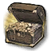

#  IW4 Open Formats
Serializer & Deserializer for most IW4 asset formats. Static library to link against when making IW4 tools.
This library can dump most IW4 formats to disk and read them back / link them together in memory.
The resulting assets can be read by IW4x Zonebuilder to be included in any zone!
